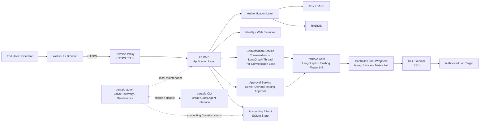

# PentAiA v2 — Phase 4 Web, Identity, Accounting, and CLI Security Architecture

## Document Control

| Field | Value |
|---|---|
| Document Title | PentAiA v2 — Phase 4 Web, Identity, Accounting, and CLI Security Architecture |
| Document ID | PENTAIA-ARCH-P4-01 |
| Version | 0.2 |
| Status | Draft — revised after independent DSH architecture review |
| Project | PentAiA v2 |
| Repository | `amdisrar/pentaia-v2` |
| Related GitHub Issue | #51 — P4-01 Define Phase 4 web, identity, accounting, and CLI security architecture |
| Owner | Israr |
| Prepared Date | 24 September 2026 |
| Classification | Project Internal / Educational Research |
| Review Requirement | Owner review required before P4-01 is closed |

## Document History

| Version | Date | Author | Change Summary | Status |
|---|---|---|---|---|
| 0.1 | 24 September 2026 | PentAiA project / AI-assisted draft | Initial Phase 4 architecture covering web, identity, sessions, accounting, approvals, secrets, break-glass, Phase 3 compatibility, and implementation mapping | Draft |
| 0.2 | 24 September 2026 | PentAiA project / merged architecture review | Revised after comparison with the independent DSH architecture draft; resolved deployment, storage, session, conversation-locking, approval-surface, accounting-integrity, break-glass, validation, and implementation-sequencing decisions; added Mermaid architecture diagram | Draft |

## Table of Contents

1. [Purpose](#1-purpose)
2. [Project Context and Safety Boundary](#2-project-context-and-safety-boundary)
3. [Scope](#3-scope)
4. [Non-Goals](#4-non-goals)
5. [Existing Phase 1–3 Baseline](#5-existing-phase-13-baseline)
6. [Phase 4 Architecture Principles](#6-phase-4-architecture-principles)
7. [Target Component Architecture](#7-target-component-architecture)
8. [Component Responsibilities](#8-component-responsibilities)
9. [Trust Boundaries](#9-trust-boundaries)
10. [Authentication Architecture](#10-authentication-architecture)
11. [Authenticated Identity Model](#11-authenticated-identity-model)
12. [Web Session Model](#12-web-session-model)
13. [Conversation and LangGraph Session Model](#13-conversation-and-langgraph-session-model)
14. [Human Approval Workflow in the Web GUI](#14-human-approval-workflow-in-the-web-gui)
15. [Browser-Reachable API Surface and Target Authorization](#15-browser-reachable-api-surface-and-target-authorization)
16. [Accounting and Audit Architecture](#16-accounting-and-audit-architecture)
17. [Secret and Configuration Ownership](#17-secret-and-configuration-ownership)
18. [Local Break-Glass and Recovery CLI](#18-local-break-glass-and-recovery-cli)
19. [Administrative and Operational Status Functions](#19-administrative-and-operational-status-functions)
20. [Failure and Recovery Scenarios](#20-failure-and-recovery-scenarios)
21. [Phase 4 vs Later-Phase Responsibility Boundary](#21-phase-4-vs-later-phase-responsibility-boundary)
22. [Deployment and Network Security Assumptions](#22-deployment-and-network-security-assumptions)
23. [Implementation Mapping to Phase 4 Issues](#23-implementation-mapping-to-phase-4-issues)
24. [Acceptance Criteria for P4-01](#24-acceptance-criteria-for-p4-01)
25. [Open Design Questions](#25-open-design-questions)
26. [Summary](#26-summary)

---

## 1. Purpose

This document defines the Phase 4 architecture for PentAiA v2.

Phase 4 introduces a normal browser-based operational interface, a FastAPI application layer, enterprise authentication, secure web sessions, authenticated conversation ownership, application accounting and audit visibility, and a local recovery path.

The primary architectural goal is to add these capabilities **without changing or weakening the execution-control model proven in Phases 1–3**.

Phase 4 must therefore be treated as an application and identity layer around the existing PentAiA engine rather than as a replacement for it.

The design established in this document will act as the implementation contract for Phase 4 issues P4-02 through P4-19.

---

## 2. Project Context and Safety Boundary

PentAiA v2 is an educational and research project for learning AI-agent engineering, security validation workflow design, security tooling integration, identity architecture, and controlled human-in-the-loop operation.

All active security testing is performed only in a controlled personal lab against deliberately vulnerable systems owned by, or explicitly authorized for use by, the project owner.

The project is not designed for unauthorized testing of third-party infrastructure.

The intended external cybersecurity impact is zero. The project retains explicit target authorization, code-owned execution, human approval, deterministic validation mappings, constrained tool access, and truthful audit records specifically to prevent uncontrolled or unintended actions.

Representative lab components include:

- PentAiA development/orchestration environment
- Kali Linux execution host
- Metasploitable2
- Mutillidae
- explicitly authorized lab targets only

Phase 4 does not change this safety boundary.

---

## 3. Scope

P4-01 defines the architecture for the following Phase 4 capabilities:

- Browser-based PentAiA GUI
- FastAPI backend
- enterprise authentication
- Active Directory authentication over LDAPS
- RADIUS authentication
- configurable authentication provider selection
- authenticated web sessions
- authenticated user identity
- authenticated conversation ownership
- integration of web conversations with LangGraph thread/session state
- web presentation of pending Phase 3 approval
- approval and rejection through authenticated server-side actions
- application accounting
- application audit visibility
- local recovery and break-glass administration
- minimal operational configuration/status functions
- secret/configuration ownership
- preservation of existing Phase 3 authorization and execution controls

---

## 4. Non-Goals

The following are explicitly outside the scope of P4-01 and should not be accidentally implemented as part of the architecture issue:

- implementing FastAPI code
- implementing the frontend
- implementing LDAPS or RADIUS code
- implementing full application RBAC
- implementing a complete settings portal
- implementing persistent agent memory
- changing Phase 3 target authorization behavior
- changing the Phase 3 approval signature model
- adding arbitrary shell access
- adding unrestricted Metasploit execution
- exposing Kali directly to the browser
- allowing the browser or model to construct native security commands
- allowing browser requests to bypass LangGraph or the existing controlled wrappers
- adding remote network access to the break-glass CLI
- storing user passwords or enterprise credentials
- placing secrets in graph state or model context

---

## 5. Existing Phase 1–3 Baseline

Phase 4 must build on the existing verified architecture.

Current baseline:

```text
User
  |
  v
CLI
  |
  v
LangGraph
  |
  v
Gemini via LangChain
  |
  v
Typed semantic tools
  |
  v
Code-owned Python wrappers
  |
  v
Single Kali SSH executor
  |
  v
Authorized lab target
```

The current implementation already includes:

- Nmap discovery
- Nuclei vulnerability discovery
- normalized findings
- deterministic supported-candidate mapping
- code-owned Metasploit operations
- target allowlist/denylist/protected-target controls
- runtime-owned callback/listener configuration
- exact Phase 3 action proposals
- SHA-256 proposal signatures
- human approval and rejection
- stale-approval detection
- execution-time authorization re-checks
- conservative result normalization
- structured Phase 3 audit events
- held validation sessions
- proof/evidence artifact verification
- explicit operator session handoff

### 5.1 Existing Trusted Execution Components

The following modules are part of the existing security-control layer and should remain authoritative in Phase 4:

```text
authorization.py
approval.py
graph.py
metasploit_wrapper.py
nmap_wrapper.py
nuclei_wrapper.py
phase3_audit.py
phase3_artifact.py
phase3_ports.py
phase3_results.py
phase3_session.py
runtime_config.py
kali_executor.py
```

### 5.2 Core Existing Invariants

Phase 4 must preserve all of these:

1. Gemini does not receive unrestricted shell access.
2. Python constructs native commands.
3. Runtime-owned and code-owned parameters cannot be overridden by the model.
4. State-changing Phase 3 actions require explicit human approval.
5. Approval is bound to the exact proposal signature.
6. Any material proposal change makes prior approval stale.
7. Target authorization is checked before execution and rechecked at execution time.
8. Deny/protected rules override allow rules.
9. Exit code alone is never treated as proof of validation success.
10. Secrets do not enter model conversation state, normal logs, audit records, or browser output.
11. Human session handoff is explicit.
12. Once handed off, operator activity must not be misrepresented as PentAiA activity.

---

## 6. Phase 4 Architecture Principles

### 6.1 Add an Interface, Do Not Add an Execution Path

FastAPI and the web GUI are presentation/application layers.

They must not create a second direct route to Kali.

Correct:

```text
Browser
   |
   v
FastAPI
   |
   v
PentAiA application/service boundary
   |
   v
LangGraph
   |
   v
Existing controlled wrappers
   |
   v
kali_executor.py
```

Incorrect:

```text
Browser
   |
   v
FastAPI
   |
   +------> direct SSH to Kali
   |
   +------> direct subprocess security commands
```

### 6.2 Server Owns Security State

The browser may display state, but must not be trusted to define it.

Server-owned items include:

- authenticated identity
- session state
- conversation ownership
- LangGraph thread identifiers
- pending approval state
- exact proposal data
- proposal signature
- target authorization decision
- runtime configuration
- audit/accounting records

### 6.3 Browser Input Is Untrusted

All browser input must be validated by FastAPI/application logic before it reaches PentAiA.

The browser must never be trusted to send:

- an authoritative username
- an authoritative role
- an approval object
- an approval signature to be accepted without server comparison
- an arbitrary command
- a module path
- a callback/listener address
- privileged runtime settings

### 6.4 Authentication Is Separate from Security-Target Authorization

User authentication answers:

```text
Who is using PentAiA?
```

Existing target authorization answers:

```text
Is PentAiA allowed to interact with this target?
```

These controls serve different purposes and must remain separate.

### 6.5 Resolved Phase 4 Design Decisions

The following decisions are fixed for the Phase 4 implementation unless a later reviewed architecture change explicitly replaces them:

| Area | Phase 4 Decision |
|---|---|
| Deployment | Single PentAiA application host, initially the same workstation/WSL host used by the current CLI |
| TLS | HTTPS terminated by a reverse proxy on the same host; forwarded-protocol headers are trusted only from the configured proxy |
| Application store | SQLite behind a repository abstraction under `PENTAIA_DATA_DIR` |
| LangGraph state | Existing in-process/checkpoint behavior remains non-durable across application restart until Phase 5 persistent-memory work |
| Browser session | Server-side session record; browser receives only an opaque random session cookie |
| Conversation concurrency | One active turn per conversation, enforced by a server-side per-conversation lock |
| Progress delivery | Normal request/response plus short polling in Phase 4; add SSE later only if the user experience requires it |
| Authentication selection | One configured provider per deployment; no automatic fallback between AD and RADIUS |
| AD default | Direct-user LDAPS bind by default; use a service account only if later directory lookups require one |
| Approval | Browser submits only approve/reject intent; authoritative proposal and approval state remain server-side |
| Accounting | Append-only typed event stream with whitelist-based redaction and integrity verification |
| Break-glass | Web GUI is normal operation; local `pentaia-admin` handles recovery; agent CLI becomes disabled by default once the web path is ready |
| Phase 4 scaling | No HA, horizontal scaling, or multi-host application topology in this phase |

These decisions deliberately keep Phase 4 small enough for the current lab while preserving a clean path to later persistence, RBAC, and scaling.

---

## 7. Target Component Architecture

### 7.1 High-Level Architecture

The primary Phase 4 architecture is maintained as a Mermaid diagram so GitHub renders it as a smooth visual diagram rather than ASCII text.



The browser remains a presentation and intent client. It does not bypass FastAPI, LangGraph, the existing controlled wrappers, or the Phase 3 authorization and approval controls.

### 7.2 Administrative Recovery Path

```text
Administrator
      |
      v
Local console / SSH to PentAiA server
      |
      v
Operating-system authenticated access
      |
      v
pentaia-admin
      |
      v
Local recovery/status operations
```

The recovery path must not depend on AD or RADIUS availability.

It must not become a network-facing PentAiA login service.

---

## 8. Component Responsibilities

## 8.1 Browser / Web GUI

Responsibilities:

- render login interface
- render conversations
- send user prompts
- render tool status and normalized results
- display exact pending approvals
- submit approve/reject intent
- display conversation history
- display permitted audit/accounting data
- display session visibility/status
- maintain normal browser-side UX state

The browser does not own authoritative security state.

## 8.2 FastAPI Application Layer

Responsibilities:

- HTTP API
- authentication orchestration
- web session handling
- CSRF protection
- server-side identity
- conversation ownership enforcement
- request validation
- integration with LangGraph
- pending approval retrieval
- authenticated approval/rejection actions
- accounting event generation
- safe response shaping
- operational status endpoints

FastAPI must not construct arbitrary native tool commands.

A Phase 4 web package should remain structurally outside the existing core execution modules. The intended dependency direction is:

```text
web application layer  --->  existing PentAiA core
existing PentAiA core  -X->  web application layer
```

This boundary should be protected by an automated import/dependency test so Phase 1–3 code does not gradually become dependent on FastAPI, browser sessions, or web identity.

A practical package layout is:

```text
src/pentaia/
  webapp/
    api/
    auth/
    identity/
    conversations/
    approval/
    accounting/
    static/
  admin_cli.py
```

The exact module names may change during implementation, but the dependency direction must not.

## 8.3 Authentication Provider Layer

Responsibilities:

- expose a common application authentication interface
- isolate provider-specific behavior
- normalize successful identity output
- normalize authentication failure
- prevent raw credentials from escaping authentication scope

Proposed conceptual interface:

```python
class AuthenticationProvider:
    def authenticate(self, username: str, password: str) -> AuthenticatedUser:
        ...
```

The exact Python interface will be defined during implementation.

## 8.4 LangGraph / PentAiA Engine

Responsibilities remain largely unchanged:

- agent workflow
- model interaction
- typed tool selection
- deterministic candidate context
- pending Phase 3 approval state
- stale approval checks
- routing
- controlled tool execution

Phase 4 may add server-managed metadata around conversations, but should avoid inserting secrets or unnecessary identity data into model-visible message state.

## 8.5 Existing Wrapper and Executor Layer

Remains authoritative for:

- native command construction
- target validation
- predefined Metasploit operations
- runtime parameter ownership
- Kali execution

## 8.6 Accounting/Audit Layer

Responsibilities:

- immutable or append-oriented application event records
- authenticated actor association
- event timestamps
- conversation/session correlation
- proposal/approval correlation
- security-relevant failure records
- operator-visible audit views where appropriate

---

## 9. Trust Boundaries

### 9.1 Trust Boundary A — Browser to FastAPI

The browser is untrusted.

Controls should include:

- HTTPS
- secure session cookies
- server-side identity
- CSRF protection for state-changing browser requests
- request validation
- origin/host controls as appropriate
- no trust in browser-supplied authorization metadata

### 9.2 Trust Boundary B — FastAPI to Authentication Provider

Credentials exist only long enough to authenticate.

Requirements:

- LDAPS for Active Directory
- protected RADIUS shared secret
- no credential logging
- no password persistence
- no password insertion into audit records
- no credential insertion into LangGraph state
- normalized identity returned to the application after successful authentication

### 9.3 Trust Boundary C — FastAPI to PentAiA/LangGraph

FastAPI may submit authenticated user prompts and resume server-owned workflow state.

Requirements:

- conversation belongs to authenticated user
- thread ID is server-owned
- pending approval belongs to the same server-side conversation
- approval decision is associated with the authenticated actor
- browser cannot replace the proposal

### 9.4 Trust Boundary D — PentAiA to Kali

Existing Phase 1–3 boundary remains.

Requirements:

- existing SSH executor
- code-owned commands
- configured key/credentials
- no direct browser-to-Kali access
- no direct model-to-Kali shell

### 9.5 Trust Boundary E — Kali to Authorized Target

Existing target authorization remains authoritative.

The introduction of web users must not imply that an authenticated user can target arbitrary addresses.

---

## 10. Authentication Architecture

Phase 4 supports two enterprise authentication backends:

- Active Directory over LDAPS
- RADIUS

A provider abstraction should prevent the rest of the application from depending on provider-specific behavior.

### 10.1 Provider Selection

Conceptual configuration:

```text
PENTAIA_AUTH_PROVIDER=ldap
```

or:

```text
PENTAIA_AUTH_PROVIDER=radius
```

Only configured providers should be initialized.

Phase 4 supports **one active authentication provider per deployment**. It does not automatically fail over from AD to RADIUS or from RADIUS to AD. Provider unavailability fails closed because silent fallback would change the authentication trust path.

Unsupported values must fail closed at application startup.

### 10.2 Active Directory / LDAPS

Expected flow:

```text
Browser
   |
   | username + password over HTTPS
   v
FastAPI
   |
   v
LDAP authentication provider
   |
   | LDAPS
   v
Active Directory
   |
   v
success / failure + normalized identity
```

Requirements:

- LDAPS only for password authentication
- certificate validation is mandatory
- direct-user bind is the Phase 4 default because it proves the supplied password without requiring a stored privileged directory credential
- a service account may be introduced only if later attribute/group searches require it
- configurable server/base DN/search behavior
- explicit CA bundle configuration may be supported for private enterprise CAs; there is no "ignore TLS verification" mode
- authentication operations require bounded timeouts
- safe failure messages
- passwords never stored
- credentials never logged
- group/role retrieval may be collected only if required by later authorization design; Phase 4 must not accidentally implement an undocumented RBAC policy

### 10.3 RADIUS

Expected flow:

```text
Browser
   |
   | username + password over HTTPS
   v
FastAPI
   |
   v
RADIUS authentication provider
   |
   v
RADIUS server
   |
   v
Access-Accept / Access-Reject
```

Requirements:

- RADIUS shared secret is application secret configuration
- shared secret never exposed to the model/browser
- password is transient
- use a maintained RADIUS client library rather than implementing packet/authenticator handling from scratch
- timeout or retry exhaustion maps to provider unavailable and fails closed
- provider response normalized to the PentAiA identity model
- RADIUS attributes do not create Phase 4 roles or target permissions

### 10.4 Authentication Failure

Authentication failures must:

- create a safe accounting event
- avoid recording passwords
- avoid leaking whether sensitive directory attributes exist
- not create an authenticated web session
- not create a LangGraph conversation

---

## 11. Authenticated Identity Model

Phase 4 requires a stable internal application identity independent of the authentication backend.

Proposed logical model:

```text
AuthenticatedUser
  user_id
  username
  display_name
  provider
  provider_subject
  authenticated_at
```

### 11.1 Internal User ID

Phase 4 uses a normalized provider-scoped identity key:

```text
user_id = "<auth_source>:<normalized_username>"
```

For example, an AD UPN is normalized to lower case and scoped to the provider. This avoids requiring directory read rights only to obtain a secondary immutable identifier.

A later phase may migrate to a rename-stable provider identifier such as AD `objectGUID` if enterprise requirements justify the additional directory lookup and migration work.

### 11.2 Provider Identity

Examples:

```text
provider = "ldap"
provider_subject = directory identity reference

provider = "radius"
provider_subject = normalized authenticated username/reference
```

### 11.3 Identity and the Model

The model generally does not need authentication credentials.

If user identity is needed for natural-language context, only the minimum safe display identity should be provided.

Secrets and authentication tokens must never enter model context.

---

## 12. Web Session Model

After successful authentication, the application creates an authenticated web session.

Logical relationship:

```text
Authenticated User
       |
       +---- Web Session
       |        |
       |        +---- Browser
       |
       +---- Conversation A
       +---- Conversation B
       +---- Conversation C
```

Recommended server-owned fields:

```text
web_session_id
user_id
created_at
last_activity_at
expires_at
authentication_provider
authentication_time
```

### 12.1 Session and Cookie Requirements

Phase 4 uses server-side session records keyed by a cryptographically random opaque session identifier. The browser cookie is a pointer to that server-side record, not a self-contained bearer of user identity or authorization data.

Required controls:

- 256-bit random session identifier
- `HttpOnly`
- `Secure`
- `SameSite=Lax`
- `Path=/`
- no broad `Domain` attribute by default
- no credentials, provider tokens, tool data, proposal data, or secret configuration in cookies
- per-session CSRF token on every state-changing browser request
- a new session identifier after every successful login
- immediate server-side destruction on logout
- server-side forced invalidation for recovery/admin use
- login throttling by normalized username and client IP
- generic client-facing authentication errors that do not distinguish wrong credentials from provider internals
- raw session IDs/cookie values are never written to accounting records or normal logs

### 12.2 Session Expiration

Default Phase 4 values are:

- idle timeout: 30 minutes, configurable
- absolute session lifetime: 12 hours, configurable and never extended

The server records both limits and invalidates the session when either is exceeded. Activity may refresh the idle timer but must not extend the absolute lifetime.

### 12.3 Session Revocation

A revoked or expired session must no longer be allowed to:

- send prompts
- view conversations
- approve pending actions
- inspect protected audit information

---

## 13. Conversation and LangGraph Session Model

The current CLI uses a LangGraph thread identifier owned by the CLI process.

Phase 4 needs explicit ownership metadata.

Proposed model:

```text
user_id
   |
   +---- web_session_id
   |
   +---- conversation_id
             |
             +---- langgraph_thread_id
```

### 13.1 Server-Owned IDs

The following must be server generated/owned:

- conversation ID
- LangGraph thread ID
- pending approval ID/reference
- web session ID

The model must not control these identifiers.

### 13.2 Conversation Ownership

Every read/write operation must verify:

```text
conversation.user_id == authenticated_user.user_id
```

unless a future explicitly designed administrative authorization model permits otherwise.

### 13.3 Phase 4 Conversation Persistence Boundary

P4-11 explicitly preserves the current in-process/session-memory behavior until Phase 5 persistent-memory work. Phase 4 therefore does **not** move LangGraph checkpoint/thread state into the application database.

The consequence must be visible and documented:

> A Phase 4 conversation may become unavailable after the PentAiA application restarts. The GUI must not imply that LangGraph conversation state is durable across restarts.

The SQLite application store may retain identity, session, accounting, and safe conversation metadata required by the Phase 4 UI, but it is not Phase 5 agent memory.

Long-term semantic memory and durable cross-restart agent state remain out of scope.

### 13.4 Conversation Concurrency

Only one active turn may run for a given conversation at a time.

A server-side per-conversation lock must serialize access to the LangGraph thread because `pending_approval` and other workflow values are stateful. A second browser request while a turn is active must receive a clear busy/conflict response rather than interleaving with the current turn.

Different conversations may run independently subject to the existing execution/runtime constraints.

### 13.5 Phase 4 Progress Delivery

Phase 4 begins with normal request/response behavior plus short polling for long-running turn status. Server-Sent Events may be added later if the GUI experience shows a real need for live streaming.

This avoids adding another connection-lifecycle mechanism before the core web workflow is stable.

---

## 14. Human Approval Workflow in the Web GUI

Phase 4 must reuse the existing Phase 3 approval model.

Existing authoritative components include:

- `Phase3ActionProposal`
- `Phase3ApprovalState`
- proposal SHA-256 signature
- `approve_phase3_action()`
- `reject_phase3_action()`
- stale approval detection

### 14.1 Approval Presentation Flow

```text
LangGraph
    |
    v
pending Phase3ApprovalState
    |
    v
FastAPI reads server-side pending approval
    |
    v
Web GUI renders exact proposal
    |
    +---------- Reject
    |
    +---------- Approve
```

The GUI should display the material proposal fields already produced by the server, including:

- action ID
- target
- rationale
- expected effect
- resolved material parameters
- proposal signature
- relevant evidence/artifact note

### 14.2 Approval Submission Flow

Conceptual flow:

```text
Authenticated browser
       |
       | POST approve
       v
FastAPI
       |
       +--> verify authenticated session
       |
       +--> load server-side conversation
       |
       +--> load server-side pending approval
       |
       +--> confirm request refers to current pending proposal
       |
       +--> call existing approval logic
       |
       +--> write accounting/audit event with actor
       |
       +--> resume LangGraph
```

### 14.3 Approval Security Rules

The browser must not be able to:

- create a new proposal
- modify target
- modify action ID
- modify runtime parameters
- replace the server proposal signature
- approve a proposal belonging to another user/conversation
- reuse an approval after the proposal changes

### 14.4 Concurrent/Stale Approval

If a proposal has changed or already been resolved, the server must reject the browser approval attempt as stale/conflicting. A stale or duplicate approval should be represented as an HTTP conflict, such as `409`, and nothing executes.

Approval resolution must be atomic: a pending proposal can transition to one terminal human decision only once.

The browser submits only an intent such as:

```json
{"decision": "approve"}
```

or:

```json
{"decision": "reject"}
```

The authoritative proposal, signature, requester identity, and pending approval are loaded server-side. The requester and approver are recorded as separate identity fields even when, in the Phase 4 single-operator model, they are normally the same user. This leaves room for a future two-person approval rule without changing the event/schema model.

Phase 3 stale-signature behavior remains authoritative.

---

## 15. Browser-Reachable API Surface and Target Authorization

Phase 4 deliberately keeps the browser API small.

Representative routes:

| Method | Route | Purpose |
|---|---|---|
| `GET` | `/healthz` | unauthenticated liveness only; no environment details |
| `GET` | `/api/status` | authenticated safe application/provider status |
| `POST` | `/api/auth/login` | authenticate and create server-side session |
| `POST` | `/api/auth/logout` | destroy current session |
| `GET` | `/api/me` | current identity projection |
| `POST` | `/api/conversations` | create conversation |
| `GET` | `/api/conversations` | list caller-owned conversations |
| `GET` | `/api/conversations/{id}` | retrieve caller-owned conversation |
| `POST` | `/api/conversations/{id}/messages` | submit natural-language user message |
| `GET` | `/api/conversations/{id}/approval` | read-only projection of current pending approval |
| `POST` | `/api/conversations/{id}/approval` | submit approve/reject decision only |
| `GET` | `/api/accounting` | caller's permitted accounting events |

The browser may naturally send a target inside the user's normal conversation text, for example "scan 172.16.0.64". That text remains **untrusted conversational input**.

The browser must never submit an authoritative structured execution target, action ID, tool arguments, runtime parameters, proposal object, approval object, proposal signature, or client-chosen execution correlation identifier. Those values are resolved and validated server-side.

### 15.1 Existing Target Authorization and Phase 3 Controls

Phase 4 authentication does not replace target authorization.

Example:

```text
User successfully authenticates
        |
        v
User asks PentAiA to assess target X
        |
        v
Existing target authorization
        |
        +---- allowed --> normal controlled flow
        |
        +---- denied --> blocked
```

An authenticated user does not automatically obtain permission to operate against arbitrary infrastructure.

Existing configuration remains authoritative:

- Phase 3 allowlist
- Phase 3 denylist
- protected targets
- runtime callback configuration
- Nuclei template restrictions

Any future per-user target authorization policy must be explicitly designed rather than inferred from authentication.

---

## 16. Accounting and Audit Architecture

Phase 4 adds application-level accounting tied to authenticated identity.

This complements, rather than replaces, current Phase 3 audit events.

### 16.1 Goals

Accounting should answer:

- who logged in
- when authentication succeeded or failed
- which user created a conversation
- which authenticated user submitted a prompt
- which tool/action lifecycle events occurred
- who approved or rejected a state-changing action
- which proposal signature was involved
- which target was involved
- when a session was handed off
- when application sessions ended or expired

### 16.2 Proposed Event Categories

Authentication:

```text
LOGIN_SUCCESS
LOGIN_FAILURE
LOGOUT
WEB_SESSION_CREATED
WEB_SESSION_EXPIRED
WEB_SESSION_REVOKED
```

Conversation:

```text
CONVERSATION_CREATED
CONVERSATION_OPENED
PROMPT_SUBMITTED
CONVERSATION_CLOSED
```

Security workflow:

```text
TOOL_REQUESTED
TOOL_COMPLETED
PROPOSAL_CREATED
APPROVAL_APPROVED
APPROVAL_REJECTED
APPROVAL_STALE
VALIDATION_STARTED
VALIDATION_COMPLETED
SESSION_HELD
SESSION_HANDOFF
SESSION_CLOSED
```

Administration:

```text
AUTH_PROVIDER_STATUS_CHECK
BREAK_GLASS_USED
RECOVERY_ACTION
OPERATIONAL_SETTING_CHANGED
```

The final event set should be implemented incrementally and kept purposeful.

### 16.3 Proposed Event Model

The implementation should use a typed event object rather than free-form dictionaries or arbitrary log payloads.

Logical fields:

```text
event_id
timestamp
event_type
outcome
user_id
auth_source
session_label
conversation_id
langgraph_thread_id
request_id
duration_ms
action_id
target
proposal_signature
requester_user_id
approver_user_id
error_type
safe_detail
previous_record_hash
record_hash
```

Not every event needs every field. Raw session-cookie values are never stored; a separate opaque session label may be used for correlation.

### 16.4 Redaction Model

Redaction is **whitelist based**, not blacklist based.

The accounting emitter accepts a typed event object and serializes only explicitly permitted fields. It must not ingest arbitrary request bodies, environment dumps, exception strings, or raw tool output and then attempt to remove secrets afterwards.

Tests must include adversarial values to verify that credentials, keys, cookie values, and secret-like inputs cannot enter serialized events.

### 16.5 Integrity Verification

Accounting records are append-only at the application layer.

Phase 4 adds a simple hash chain:

```text
record_hash = SHA256(previous_record_hash || canonical_event)
```

A local administrative command such as:

```text
pentaia-admin accounting verify
```

can verify the chain and detect inconsistent modification/deletion inside the event history.

This is **integrity verification / tamper detection**, not a claim of absolute tamper-proof storage. Stronger guarantees would require an external anchor or remote immutable log destination.

### 16.6 Prohibited Audit Content

Never record:

- passwords
- LDAP bind passwords
- RADIUS shared secrets
- API keys
- SSH private keys
- raw session cookies
- authentication tokens
- arbitrary sensitive environment variables

Existing Phase 3 behavior of storing a stable reference rather than raw evidence text should continue where appropriate.

### 16.7 Audit Truthfulness

Audit records must distinguish:

- model recommendation
- PentAiA proposal
- human approval
- PentAiA execution
- observed evidence
- human session handoff
- human-controlled activity after handoff

PentAiA must not claim ownership of operator actions after explicit handoff.

---

## 17. Data, Secret and Configuration Ownership

Phase 4 should continue the project's parameter-ownership philosophy.

### 17.1 Application Store

Phase 4 uses SQLite on the PentAiA application host, accessed only through a repository abstraction.

Requirements:

- database and data directory live under `PENTAIA_DATA_DIR`
- restrictive host permissions; database/data files should be owner-only where supported
- schema migrations are versioned from the beginning
- WAL mode and an appropriate busy timeout should be considered during implementation for safe local concurrency
- accounting and server-side web-session records survive application restart
- LangGraph thread/checkpoint state remains outside this store in Phase 4
- repository interfaces must avoid coupling business logic directly to SQLite so a later database migration remains possible

### 17.2 Application-Owned Configuration

Examples:

```text
AUTH_PROVIDER
DATABASE_URL
SESSION_SECRET / session signing or encryption material
cookie/security configuration
audit destination
application host/port configuration
```

### 17.3 Authentication Infrastructure Secrets

Examples:

```text
LDAP server configuration
LDAP bind identity
LDAP bind password
RADIUS server
RADIUS shared secret
CA/certificate trust configuration
```

### 17.4 Existing PentAiA Runtime Configuration

Examples:

```text
GOOGLE_API_KEY
GEMINI_MODEL
KALI_HOST
KALI_PORT
KALI_USERNAME
KALI_SSH_KEY
PENTAIA_LHOST
PENTAIA_LPORT
PENTAIA_LPORT_MIN
PENTAIA_LPORT_MAX
PENTAIA_PHASE3_ALLOWLIST
PENTAIA_PHASE3_DENYLIST
PENTAIA_NUCLEI_DENYLIST
```

### 17.5 Secret Flow Rule

Secrets may be consumed only by the component that requires them.

They must not be copied into:

- user prompts
- AI messages
- LangGraph model-visible messages
- normal browser responses
- audit records
- Git commits

### 17.6 Configuration Validation

Invalid security-sensitive configuration should fail closed at application startup where practical.

Examples:

- unknown authentication provider
- insecure LDAP configuration when LDAPS is required
- missing required RADIUS secret
- missing session secret
- invalid target authorization configuration

---

## 18. Local Break-Glass and Recovery CLI

Phase 4 retains a local administrative path for recovery when the normal web or enterprise authentication path is unavailable.

### 18.1 Intended Use

Examples:

- AD unavailable
- RADIUS unavailable
- authentication misconfiguration
- web session subsystem failure
- need to inspect service status
- emergency recovery/configuration correction

### 18.2 Trust Model

Break-glass access is based on access to the PentAiA host itself.

```text
Administrator
      |
      v
OS-authenticated local/SSH access
      |
      v
pentaia-admin
```

Therefore:

- it is not exposed as a public HTTP login mechanism
- it does not depend on AD/RADIUS
- it does not implement another remote password database
- host access controls protect it

### 18.3 Three-Interface Split

Phase 4 deliberately separates:

| Interface | Purpose | Identity/Trust | Normal State |
|---|---|---|---|
| Web GUI | normal operations | AD or RADIUS | enabled |
| `pentaia` CLI | local break-glass agent interface | server OS access plus explicit enablement | disabled by default once the web workflow is ready |
| `pentaia-admin` | local maintenance/recovery, no LLM | server OS access / sudo as appropriate | invoked locally when needed |

The existing CLI remains usable during development until the web path is sufficiently complete to become the normal interface. The project must not disable its only working operator interface at the start of Phase 4.

When the transition is made, the agent CLI must fail clearly when disabled and may be enabled only through a predefined local administrative operation. Gemini and normal web users cannot enable it.

Existing `pentaia session list|show|attach|close` functionality is operational maintenance rather than LLM conversation functionality and should move under `pentaia-admin` so held sessions can still be inspected or closed during an enterprise-identity outage.

Break-glass functions require explicit local administrative invocation and never provide arbitrary shell execution.

### 18.4 Audit

Break-glass use should generate an accounting/audit event where the application/audit subsystem is available.

The event should state that local recovery was used.

### 18.5 Scope Limitation

The break-glass utility is for recovery/administration.

It must not become a shortcut that bypasses existing Phase 3 target authorization or approval controls for normal security validation.

---

## 19. Administrative and Operational Status Functions

Phase 4 requires only minimal status/configuration functions needed for safe operation.

Possible read-only status items:

- current authentication provider
- authentication backend reachability
- database status
- LangGraph/application status
- Kali execution-host reachability
- audit subsystem status
- configured model name
- listener pool status
- held session count

Sensitive values must not be displayed.

Examples of values that should never be rendered:

- LDAP password
- RADIUS secret
- API keys
- SSH private key contents
- raw session secret

A full settings/admin portal is not part of P4-01.

---

## 20. Failure and Recovery Scenarios

### 20.1 Active Directory Unavailable

Expected behavior:

- LDAP login fails safely
- no authenticated web session is created
- safe accounting event generated
- existing authenticated sessions follow configured session policy
- local break-glass remains available to host administrators

### 20.2 RADIUS Unavailable

Expected behavior mirrors AD failure:

- login fails safely
- credentials are not logged
- no fallback to an insecure local web password
- break-glass remains local to the host

### 20.3 Authentication Succeeds but PentAiA Engine Is Unavailable

Expected behavior:

- user remains authenticated
- GUI reports application engine unavailable
- no direct fallback to Kali
- accounting records operational failure

### 20.4 Kali Unavailable

Expected behavior:

- existing executor returns unavailable/failure status
- FastAPI does not bypass the executor
- GUI shows safe normalized error
- no secret/SSH details exposed

### 20.5 Browser Submits Approval After Proposal Changed

Expected behavior:

- approval refused as stale
- nothing executes
- user sees that the approval is no longer current
- audit/accounting records stale attempt as appropriate

### 20.6 Browser Session Expires While Approval Is Pending

Expected behavior:

- approval cannot be completed without an authenticated session
- pending action remains unexecuted
- reauthentication does not silently approve it
- server decides whether the pending proposal remains viewable/current after reauthentication

### 20.7 Database or Accounting Store Unavailable

The implementation must define fail behavior before Phase 4 production use.

For security-significant operations such as approval, the project should prefer fail-closed behavior if required audit/accounting guarantees cannot be met.

Phase 4 decision: authentication/session/accounting read paths may report a degraded service where safe, but a state-changing Phase 3 approval/execution must fail closed if its required durable accounting event cannot be committed. The system must not execute first and silently discover afterwards that the accountable approval/action record could not be stored.

### 20.8 Web Application Compromise Assumption

FastAPI is a trusted application component; therefore it must be treated as a critical security boundary.

Even so, defense in depth remains:

- Phase 3 target authorization remains in the execution layer
- code-owned wrapper constraints remain
- runtime-owned values remain protected
- approval signature checking remains in shared application logic

---

## 21. Phase 4 vs Later-Phase Responsibility Boundary

The current issue states that Phase 4 implements authentication and accounting while full application RBAC/authorization is deferred.

The project backlog also currently uses Phase 5 for persistent memory.

This creates a naming/roadmap ambiguity that should be cleaned up before later implementation, but it does not block P4-01.

### 21.1 Phase 4 Responsibilities

Phase 4:

- GUI
- FastAPI
- enterprise authentication
- authenticated identity
- secure web sessions
- conversation ownership
- application accounting/audit
- web approval integration
- session visibility
- local recovery utility
- minimal operational status/configuration

### 21.2 Not Phase 4

Deferred unless explicitly re-planned:

- full application RBAC
- complex multi-role policy
- per-user target entitlement policy
- full settings/admin portal
- long-term semantic/persistent AI memory
- advanced multi-tenant isolation
- arbitrary provider/plugin marketplace

### 21.3 Existing Target Authorization Remains

Even before application RBAC exists, Phase 3 target authorization remains mandatory and unchanged.

---

## 22. Deployment and Network Security Assumptions

P4-01 defines the initial Phase 4 deployment as a **single-host application** on the PentAiA host currently used by the CLI.

Architecture assumptions:

- a reverse proxy on the same host terminates HTTPS
- FastAPI/uvicorn runs as an unprivileged application service behind that proxy
- the application trusts forwarded-protocol information only from the explicitly configured proxy
- GUI static assets and the JSON API may be served from the same origin to keep cookie, CORS, and CSRF behavior simple
- the browser reaches PentAiA over HTTPS
- the FastAPI service is not used as a direct Kali proxy
- Kali remains on a controlled network path
- enterprise authentication traffic follows controlled network paths
- LDAPS certificate validation is enforced
- RADIUS shared secrets are protected
- application secrets are stored outside source control
- production debug output is disabled
- session cookies are protected
- host access to the break-glass utility is restricted
- database/audit storage access is restricted to required components

Detailed deployment instructions are planned for P4-19.

---

## 23. Implementation Mapping to Phase 4 Issues

The P4-01 architecture maps to the current backlog as follows.

| Issue | Implementation Area | Architecture Dependency |
|---|---|---|
| P4-01 / #51 | Architecture | This document |
| P4-02 / #52 | FastAPI backend | Sections 6–9 |
| P4-03 / #53 | Web GUI shell | Sections 7–8 |
| P4-04 / #54 | Identity/session model | Sections 11–12 |
| P4-05 / #55 | AD over LDAPS | Section 10.2 |
| P4-06 / #56 | RADIUS | Section 10.3 |
| P4-07 / #57 | Provider selection | Sections 10.1 and 17 |
| P4-08 / #58 | Web session hardening | Sections 9 and 12 |
| P4-09 / #59 | Accounting/audit subsystem | Section 16 |
| P4-10 / #60 | Audit viewer | Sections 16 and 19 |
| P4-11 / #61 | Web conversation + LangGraph | Section 13 |
| P4-12 / #62 | Web human approval | Section 14 |
| P4-13 / #63 | Conversation history/session visibility | Sections 12–13 |
| P4-14 / #64 | Local admin recovery/break-glass | Section 18 |
| P4-15 / #65 | Minimal admin/status page | Section 19 |
| P4-16 / #66 | AD end-to-end validation | Sections 10.2, 12 |
| P4-17 / #67 | RADIUS end-to-end validation | Sections 10.3, 12 |
| P4-18 / #68 | Complete Phase 4 validation | Entire architecture |
| P4-19 / #69 | Deployment/auth/accounting/recovery docs | Sections 17, 18, 22 |

### 23.1 Recommended Implementation Order

The implementation order should preserve the current working CLI until the web path is ready, while establishing security/accounting foundations before high-risk approval integration.

| Step | Issue(s) | Purpose |
|---:|---|---|
| 1 | P4-02 / #52 | FastAPI foundation, config loading, health endpoint, same-origin web foundation, import-boundary test |
| 2 | P4-09 / #59 | SQLite repository, typed accounting events, whitelist redaction, hash-chain verification |
| 3 | P4-04 / #54 + P4-08 / #58 | identity model and hardened server-side sessions, CSRF, fixation protection, timeouts, throttling |
| 4 | P4-05 / #55 + P4-07 / #57 | AD/LDAPS provider and configuration-driven provider selection |
| 5 | P4-03 / #53 | GUI shell using the defined API surface |
| 6 | P4-11 / #61 | conversation-to-LangGraph mapping, ownership checks, per-conversation locking |
| 7 | P4-12 / #62 | web approval workflow reusing existing Phase 3 approval logic unchanged |
| 8 | P4-13 / #63 | authenticated conversation/history visibility with the restart-persistence limitation clearly shown |
| 9 | P4-14 / #64 | introduce `pentaia-admin`, move operational session commands, then transition the agent CLI to disabled-by-default |
| 10 | P4-06 / #56 | RADIUS provider with mocked accept/reject/timeout/malformed coverage |
| 11 | P4-10 / #60 | caller-visible accounting viewer; all-user administration remains local until later RBAC |
| 12 | P4-15 / #65 | minimal safe operational/status page |
| 13 | P4-16 / #66 | real AD/LDAPS end-to-end validation |
| 14 | P4-17 / #67 | real RADIUS end-to-end validation when a lab RADIUS environment is available |
| 15 | P4-18 / #68 | complete Phase 4 GUI, identity, accounting, isolation, and approval validation |
| 16 | P4-19 / #69 | deployment, authentication, accounting, recovery, and known-gap documentation |

If no RADIUS infrastructure is available when P4-17 is reached, #67 remains open as an explicitly documented validation gap. A controlled lab FreeRADIUS instance may be introduced later to complete the end-to-end validation rather than treating mocked tests as equivalent to #67.

Working protocol remains unchanged: one bounded issue at a time, code plus automated tests, operator/lab validation, owner review, then issue closure.
---

## 24. Acceptance Criteria for P4-01

P4-01 is ready for owner review when all of the following are documented:

- [x] Phase 4 component architecture
- [x] browser → GUI → FastAPI → LangGraph boundary
- [x] FastAPI is not a second direct Kali execution path
- [x] AD/LDAPS trust flow
- [x] RADIUS trust flow
- [x] authentication provider abstraction
- [x] authenticated identity model
- [x] secure web session model
- [x] conversation/LangGraph ownership model
- [x] web approval model
- [x] existing Phase 3 approval signature preserved
- [x] existing target authorization preserved
- [x] application accounting event model
- [x] secret/configuration ownership
- [x] local break-glass model
- [x] Phase 4 vs later-phase boundary
- [x] failure/recovery scenarios
- [x] implementation mapping to P4-02 through P4-19
- [x] single-host deployment and TLS boundary resolved
- [x] SQLite application-store decision resolved
- [x] Phase 4 in-process LangGraph persistence boundary resolved
- [x] conversation locking model documented
- [x] browser API surface documented
- [x] accounting integrity/redaction model documented
- [x] Mermaid architecture diagram included
- [ ] owner review and acceptance

No Phase 4 code is required for P4-01 itself.

---

## 25. Remaining Implementation Choices and Validation Gap

Most architecture-level questions raised in v0.1 are resolved in v0.2. The remaining choices are intentionally implementation-level.

### 25.1 Frontend Technology

The architecture requires a same-origin browser GUI but does not mandate a specific frontend framework. P4-03 may choose the smallest maintainable approach that supports login, conversations, approval display, polling, and safe status/accounting views without changing the API/security boundaries in this document.

### 25.2 Exact CSRF Implementation

CSRF protection is mandatory for state-changing browser requests. The concrete token transport/validation mechanism is selected alongside the session and frontend implementation in P4-04/P4-08.

### 25.3 RADIUS End-to-End Validation

The RADIUS provider is implemented and tested with mocks in P4-06, but P4-17 requires a real end-to-end environment. If no existing RADIUS service is available, #67 remains open until a controlled lab RADIUS service such as FreeRADIUS is available for validation.

### 25.4 Future RBAC Roadmap

Phase 4 performs authentication and preserves the existing target-authorization controls; it does not add application RBAC. The backlog currently associates persistent memory with Phase 5 while some earlier wording also referred to later RBAC as Phase 5. That roadmap naming should be normalized before RBAC work begins, without changing the Phase 4 scope.
---

## 26. Summary

Phase 4 transforms PentAiA from a CLI-only research agent into an authenticated web application while preserving the security boundaries already proven in Phases 1–3.

The primary architecture is:

```text
Browser / GUI
      |
      v
FastAPI
      |
      +---- Authentication (LDAPS or RADIUS)
      |
      +---- Secure Web Session
      |
      +---- Accounting / Audit
      |
      v
Existing PentAiA / LangGraph engine
      |
      v
Existing code-owned wrappers
      |
      v
Existing Kali SSH executor
      |
      v
Authorized lab target
```

The most important architectural rule is that Phase 4 adds identity, usability, accountability, and recovery around the existing PentAiA engine; it does not create a new execution path.

Version 0.2 also fixes the initial implementation model: single-host deployment behind a reverse proxy, SQLite application storage, server-side web sessions, one active turn per conversation, in-process LangGraph state until Phase 5, server-owned approval state, append-only typed accounting with integrity verification, and local-only break-glass administration.

The existing Phase 3 controls remain mandatory:

- deterministic supported actions
- target authorization
- code-owned native commands
- runtime-owned protected parameters
- exact proposal signatures
- explicit human approval
- stale-approval rejection
- evidence-based result normalization
- truthful audit records
- explicit human session handoff

This document should be reviewed and accepted before P4-02 FastAPI implementation begins.
